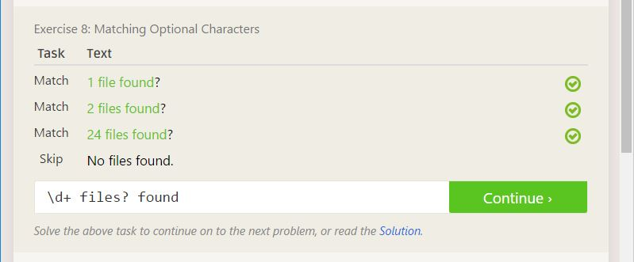
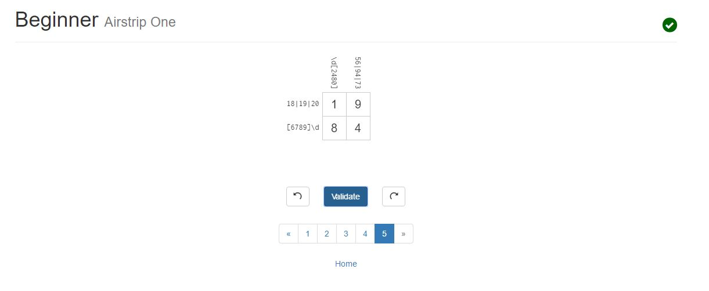
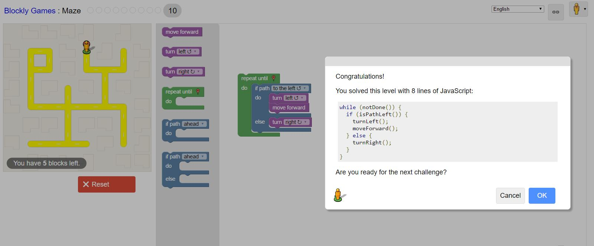

## The Open Source Definition
The open source definition applies to more than just the freedom to view the source code for some sofware.  You are also given the freedom to redistribute the software and make derivations of it.  The software must not discriminate against its users and should give the same freedoms to all of its users.  If the author of the software wishes to prevent modified versions of the software from being distributed, they must state this in their license.  The license must be specific to their product, and must not restrict how other software of technology works.

## How To Ask Questions the Smart Way
The key to finding out what you what is doing your research before asking a question.  There is are tons of resources available to everyone that can help you find out what you want.  If everyone used all of the free resources available to them before asking questions, we would have a lot less.
If you can't find the answer to what you're looking for, make sure that your question is a good one.  First, make sure you ask the right person, and ask in a place whre the techinicality of the question is appropriate.  You should try aking on public forums like stack exchange where varyling levels of technicality are expected, and where the questions and answers are public.
Your question should have a meaningful subject, and should give a quick introduction to the problem.  Make sure that you proofread your questions and use proper grammar.  Make sure your question describes your problem precisely.  Describe the symptoms, and not your guesses as to how to solve the problem.

## Chapter 3 of Free Culture
This chapter talks about the story of Jesse Jordan, a Freshman at RPI in 2002.  He modified a search engine to give access to the network of RPI.  This allowed a search engine to index all of the publicly available files on the RPI network, many of which were copyrighted works.  Jesse was contacted by the RIAA, who notified him that the intended to file a lawsuti for $15 million in damages.  After negotiation, the RIAA offereed to settle for all of Jesse's savings, $12,000.  Jesse would be forced to Take the settlement, or face an expensive lawsuit, and he ultimately had to choose the settlement wher ehe would admit guilt.  It's unfortunate that although the odds may have been in his favor for winning the case, the risk was not worth the reward.  It's an unforunate moral delimma.

## Other Stuff

