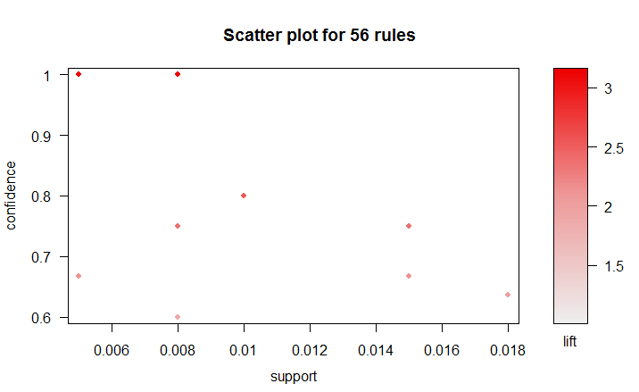

## Association rules:
    lhs         rhs       support confidence lift 
[1] {rank=4} => {admit=0} 0.138   0.821      1.203

Only one association rule was found with default settings.  There is an association between rank and denial for admission with confidence 0.821

Another association rule: if your GPA is 2.82, there is a 100% chance that you got a 600 on the GRE

Limiting support to 0.15, confidence to 0.6, and an appearance of admit=1 on the right hand side, we find 3 other association rules:
[1] {gre=800,rank=1} => {admit=1} 0.015   0.750      2.362
[2] {gpa=4,rank=1}   => {admit=1} 0.015   0.667      2.100
[3] {gre=660,rank=2} => {admit=1} 0.018   0.636      2.004
These all seem fairly logical.  A 4.0 GPA at a rank 1 school should get you into grad school at RPI.

## Plot
Photo of Me 

## Status of project
My project is moving along very slowly to say the least.  I have not worked on any part of it yet.  I'm not too excited about the idea of the project, and wished I had joined another team's, but I'll have to make the most of it.  This week I will start the project by developing the application.  I will probably use C# for the project, as I am most familiar with using .net for developing GUI applications.  Work on licensing and plugins will happen after the basic application is developed in a few weeks.  I expect that by the end of the semester, I will have an idea of how to best license plugins.